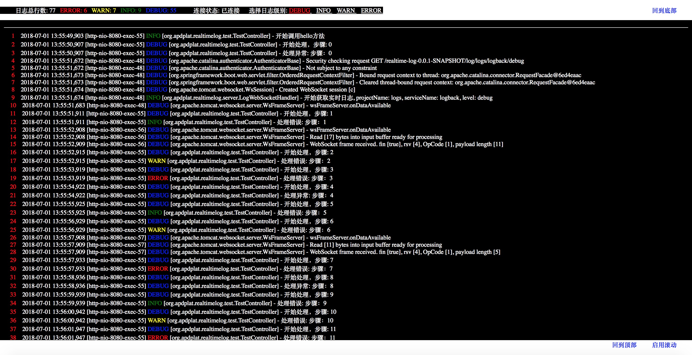
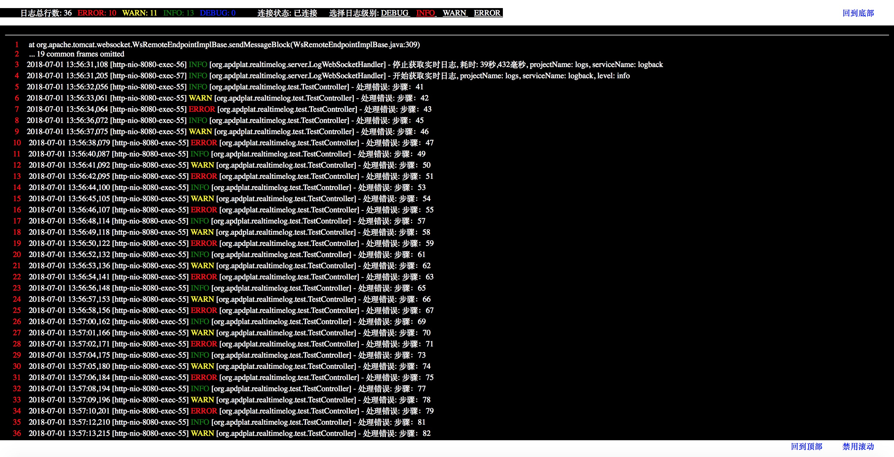

### 微服务日志之实时日志

   在微服务架构中，一般会有几百甚至几千个服务，这些服务可能会被自动部署到集群中的任何一台机器上，因此，开发人员在开发的时候，要想实时查看日志输出就很不方便了，首先需要查询出服务被部署到哪一台机器上了，其次要向管理员申请目标机器的访问权限，接着要用SSH登录到目标服务器上，使用tail -f来查看实时日志，而tail -f的功能很有限，使用起来也很不方便。这个开源项目就是为了解决微服务架构下日志的实时查看问题，使开发人员无需服务器权限就能获得强大灵活方便的查看实时日志的能力。

一、编译程序:

    mvn clean install package

二、启动程序:

    jar -jar log-viewer-2.2.5.RELEASE.jar
    

五、查看实时日志：

    http://localhost:8080/log/index?serviceName=rqmWeb
    http://localhost:444/log/index?serviceName=rhmWeb
    http://localhost:444/log/index?serviceName=rhmMobile
    
实际运行效果如下：

